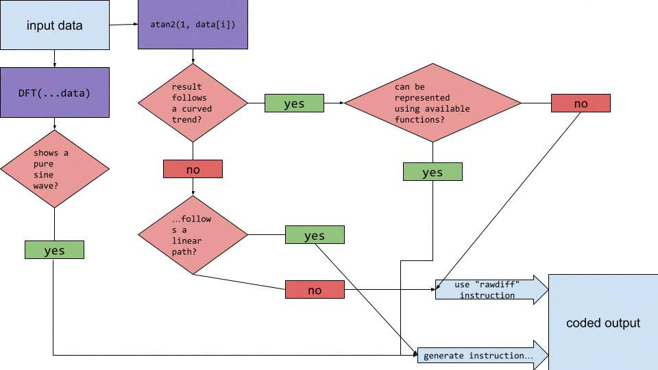

# Heuristics
This section discusses a proposed algorithm which is used to decide which instuction to use.

## Flow
Below is a diagram describing the flow of this algorithm.
<!-- insert image here -->

## Step 1: atan2
The encoder will first calculate the atan2 of a sample, recording it's results along the way. If it detects a meaningful curve, it uses another heuristics algorithm to generate a meaningful function. If it is not a curve, it checks if it goes in a linear path, given some constraints. If so, it uses the `line` instruction. If both conditions are false, the encoder returns a `rawdiff` instruction.

## Step 2: DFT
The encoder will calculate a 512-point Discrete Fourier transform to detect if the waveform is outputting pure sine waves. If it detects a pure sine wave, the encoder will narrow down how many samples have the sine wave and will output a `dirsine` instruction.